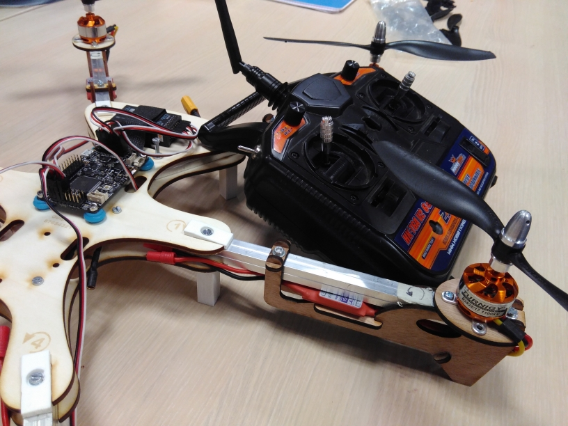

# FabCopter
An easy to repair hexacopter drone made at Fabelier

The frame and the support should be lasercutted in a 3mm plywood.
Some part should be printed with stereolithography 3d-printer.

## TODO
- Add the Bill of Material
